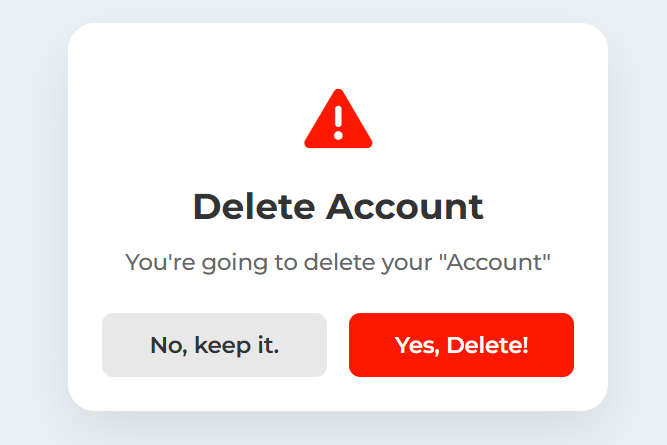
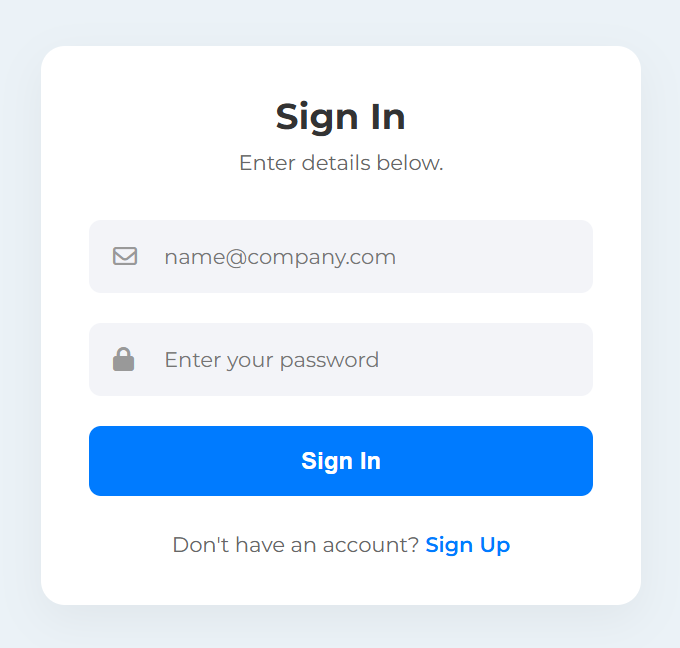
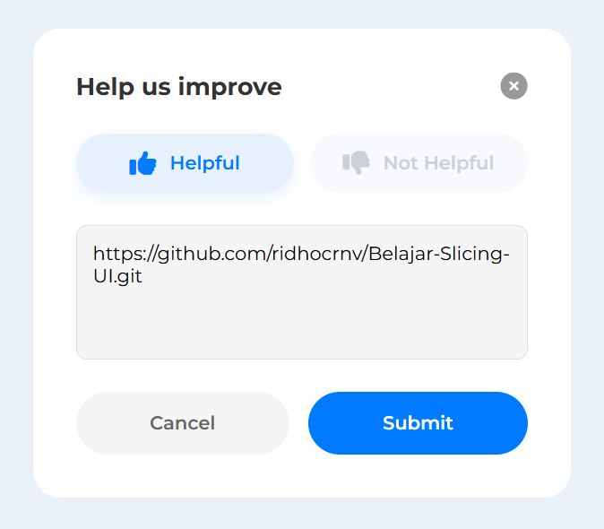

# 🚀 Belajar Slicing UI

Repository ini berisi dokumentasi perjalanan saya dalam mempelajari **HTML, CSS, dan UI Slicing**. Setiap folder merepresentasikan satu tantangan komponen UI yang berbeda.

Tujuan repo ini adalah untuk melatih kemampuan layouting, styling, dan responsive design.

## 🎨 Galeri Proyek (Project Gallery)

| No | Preview | Project & Deskripsi | Tech Stack |
| :--: | :---: | :--- | :--- |
| 01 |  | **[Delete Modal](./01-delete-modal)**<br>Modal konfirmasi hapus akun dengan layout centering, responsive width, dan semantic HTML. | HTML, CSS (Flexbox), FontAwesome |
| 02 |  | **[Sign In Card](./02-sign-in-card)**<br>Kartu login minimalis. Implementasi teknik *input wrapper* untuk ikon di dalam input, *focus-within state*, dan atribut ARIA untuk aksesibilitas. | HTML, CSS (Flexbox, Absolute Position), FontAwesome |
| 03 |  | **[Verification Code](./03-verification-code)**<br>Kartu input OTP 4 digit. Fokus pada interaksi input (`maxlength`, `text-align`), visual hierarchy dengan *Hairline Divider*, dan estetika background menggunakan **Radial Gradient**. | HTML, CSS (Flexbox, Radial Gradient) |
| 04 |  | **[Rating Modal](./04-rating-modal)**<br>Kartu input rating. Fokus pada interaksi input (`rating button`, `textarea`), Modal feedback interaktif. Menggunakan tombol semantic (Merah untuk negatif, Biru untuk positif) saat hover/focus, layout tombol horizontal, dan textarea yang di-lock resize-nya. | HTML, CSS (Flexbox, Semantic States), FontAwesome

## 🛠️ Teknologi Umum
* **HTML5**: Semantic Markup, Forms & Input Validations.
* **CSS3**: Modern Layouts (Flexbox), Positioning (Absolute/Relative), Gradients.
* **Git/GitHub**: Version control & Conventional Commits.

## 🚀 Cara Menggunakan
1. Clone repository ini:
   ```bash
   git clone [https://github.com/ridhocrnv/Belajar-Slicing-UI.git](https://github.com/ridhocrnv/Belajar-Slicing-UI.git)